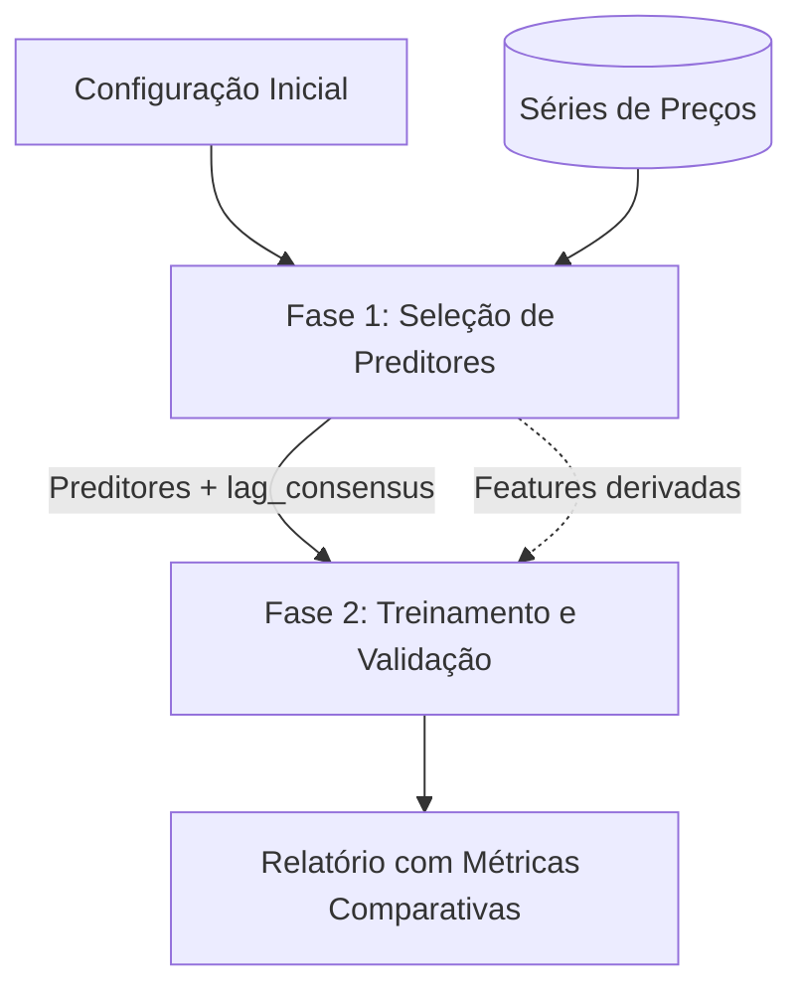
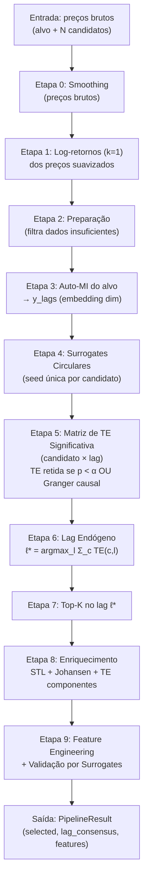
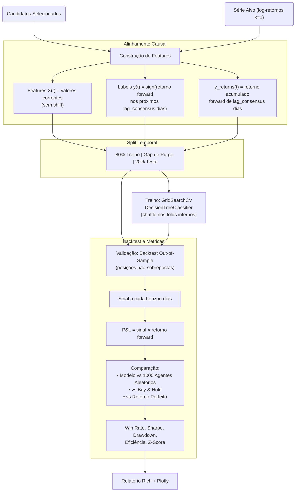

# Finalise

## Descrição do Módulo
O módulo **Finalise** é uma pipeline analítica e preditiva causal desenvolvida em Python para séries temporais financeiras. O sistema orquestra a seleção rigorosa de preditores baseada em Transfer Entropy (TE) com teste de significância por surrogates circulares, seguida de modelagem preditiva via árvore de decisão configurada como bot de trading. O fluxo garante a ausência de viés de antecipação (*look-ahead bias*) e validação out-of-sample com split temporal.

## Instalação
O projeto utiliza o gerenciador de pacotes `uv` e requer Python >= 3.12. 
As dependências essenciais incluem `numpy`, `pandas`, `plotly`, `scipy`, `statsmodels`, `scikit-learn`, `rich`, entre outras.

Para instalar e sincronizar o ambiente, execute na raiz do projeto:
```bash
uv sync
```
Alternativamente, usando `pip` para instalar o pacote no seu ambiente Python atual de forma editável:
```bash
pip install -e .
```

## Lógica Geral de Análise (Pipeline Finalise)

A pipeline é executada a partir de `demo_pipeline.py`, que encadeia a execução sequencial das duas fases principais. O processo é parametrizado por um objeto `Config` compartilhado.



## Submódulo: Predictors (`src/finalise/workflows`)

Pipeline v5 de seleção de preditores baseada em Transfer Entropy com teste de significância por surrogates circulares.



**Análises Realizadas (Pipeline v5)**:
- **Smoothing e Log-retornos**: Aplica filtros passa-baixa antes do cálculo de log-retornos diários.
- **Transfer Entropy com Surrogates**: Para cada candidato e cada lag, a TE observada é comparada contra uma distribuição nula gerada por deslocamento circular. O p-valor determina significância. Granger causality serve como critério complementar.
- **Lag Consensual**: O lag que maximiza a soma total de TE significativa entre todos os candidatos.
- **Enriquecimento Pós-Seleção**: Decomposição STL, cointegração de Johansen, e features derivadas (rolling stats) validadas individualmente por surrogates.

## Submódulo: Model (`src/finalise/model`)

O submódulo `model` implementa um **bot de trading** baseado em árvore de decisão. Dado que a análise de TE identificou o `lag_consensus` como horizonte de previsibilidade, o modelo decide: *"dado o estado atual dos preditores, devo comprar ou vender, para fechar a posição em `lag_consensus` dias?"*



**Destaques**:
- **Sem Look-Ahead Bias**: Features usam valores correntes dos preditores; labels são forward-looking. A causalidade é garantida pelo design.
- **Split Temporal com Purge**: Primeiros 80% para treino, gap de `horizon` observações, últimos 20% para teste. O modelo nunca vê dados de teste.
- **Posições Não-Sobrepostas**: No backtest, uma decisão é tomada a cada `horizon` dias, evitando correlação entre trades consecutivos.
- **Benchmarks Completos**: O modelo é comparado contra agentes aleatórios (z-score), buy-and-hold, e retorno perfeito (perfect foresight).
- **Métricas de Trading**: Win rate (total e por classe), Sharpe ratio anualizado, max drawdown, eficiência vs perfeito, retorno anualizado.
