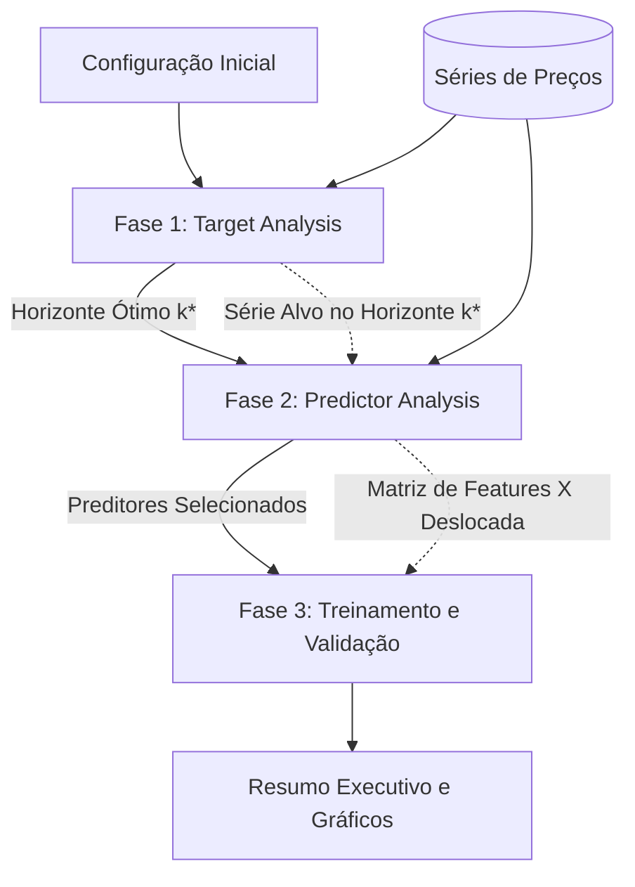
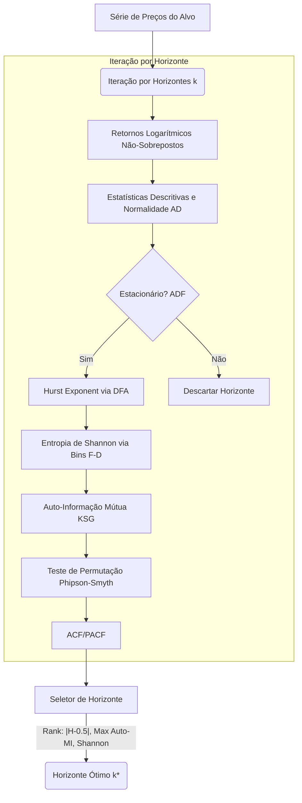
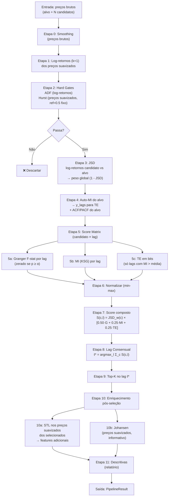
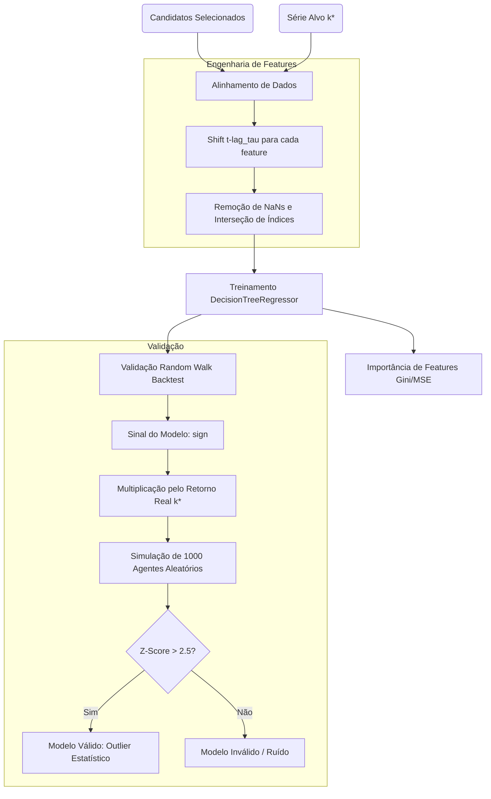

# Finalise

## Descrição do Módulo
O módulo **Finalise** é uma pipeline analítica e preditiva causal desenvolvida em Python para séries temporais financeiras. O sistema orquestra a análise de um ativo alvo, a seleção rigorosa de preditores baseada em causalidade (linear e não-linear) e a modelagem preditiva, garantindo a ausência de viés de antecipação (*look-ahead bias*). O fluxo é gerido pelo orquestrador principal e dividido em três submódulos fundamentais: `target`, `predictors` e `model`.

## Instalação
O projeto utiliza o gerenciador de pacotes `uv` e requer Python >= 3.12. 
As dependências essenciais incluem `numpy`, `pandas`, `plotly`, `scipy`, `statsmodels`, `scikit-learn`, `rich`, entre outras.

Para instalar e sincronizar o ambiente, execute na raiz do projeto:
```bash
uv sync
```
Alternativamente, usando `pip` para instalar o pacote no seu ambiente Python atual de forma editável:
```bash
pip install -e .
```

## Lógica Geral de Análise (Pipeline Finalise)

A pipeline é executada a partir de `analyze.py`, que encadeia a execução sequencial das três fases principais. O processo é parametrizado por um objeto `Config` compartilhado.



## Submódulo: Target (`src/finalise/target`)

O submódulo `target` foca em analisar a série temporal do ativo alvo em diferentes horizontes temporais (escalas) e eleger a escala `k` que apresenta as melhores propriedades preditivas.



**Análises Realizadas**:
- **Retornos**: Calculados com espaçamento de tamanho `k` (sem sobreposição).
- **Estatísticas e Normalidade**: Teste de Anderson-Darling; define o `alpha` dinamicamente (0.05 se normal, 0.02 caso contrário).
- **Estacionariedade (ADF)**: Séries I(1) são descartadas.
- **Expoente de Hurst (DFA)**: Mensura previsibilidade (desvio de 0.5 indica persistência ou reversão à média).
- **Entropia e Auto-MI**: A regra de Freedman-Diaconis estima os bins. O estimador KSG k-NN calcula a Auto-Informação Mútua. Um teste de permutação avalia a significância estatística.
- **Seleção**: Classifica horizontes por distância do Hurst em relação a 0.5, valor de Auto-MI máximo e entropia de Shannon.

## Submódulo: Predictors (`src/finalise/workflows`)

O submódulo orquestra a pipeline v4 de avaliação multicritério de causalidade, selecionando candidatos baseando-se em um score composto de métricas lineares e não lineares, além de aplicar *Hard Gates* para descartar ruído precocemente.



**Análises Realizadas (Pipeline v4)**:
- **Smoothing e Log-retornos**: Aplica filtros passa-baixa antes do cálculo de log-retornos.
- **Hard Gates**: Rejeita ativamente séries não-estacionárias (via ADF) e *random walks* genuínos (onde o expoente de Hurst se concentra rigidamente em $0.5 \pm tolerância$).
- **Score Matrix e Lag Consensual**: Extrai estatísticas Granger (linear), Mutual Information e Transfer Entropy (não-linear). Multiplica pela Similaridade de Distribuição Global (1 - Divergência de Jensen-Shannon) e pontua simultaneamente múltiplos lags para descobrir o lag ótimo (Top-K) que unifica as decisões do mercado.
- **Enriquecimento Pós-Seleção**: Realiza a decomposição causal STL e verifica Spreads cointegrados via Johansen apenas para o Top-K que sobreviveu à filtragem pesada.

## Submódulo: Model (`src/finalise/model`)

O submódulo `model` alinha estritamente as características preditivas de forma atrasada e providencia o aprendizado de máquina e validação simulada.



**Análises Realizadas**:
- **Engenharia (`features.py`)**: Utiliza os lags ótimos `lag_tau` extraídos na fase de preditores aplicando estrito descolamento (`shift`) causal, impedindo fuga de informações futuras.
- **Machine Learning (`tree.py`)**: Ajusta um `DecisionTreeRegressor` e mensura os pesos de cada variável.
- **Validação Tipo Random Walk (`validation.py`)**: Gera empiricamente os retornos que seriam obtidos por 1000 agentes operando a esmo. Ao calcular a pontuação `z-score` e estipular um nível crítico (`> 2.5`), comprova a genuinidade da taxa de acerto do modelo preditivo.
