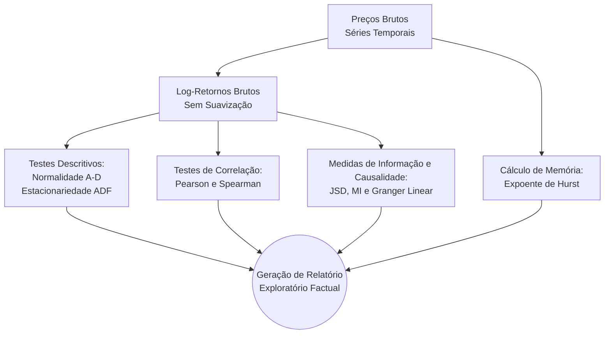
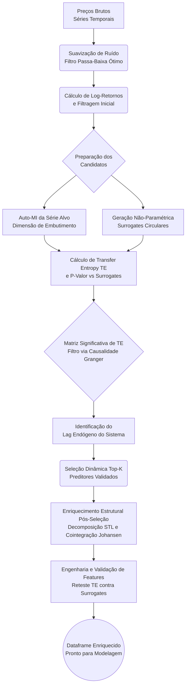

# Finalise (st-fin-analise)

O **finalise** é um sistema avançado desenvolvido para análise preditiva e causal de séries temporais financeiras. O núcleo do projeto é fundamentado na Teoria da Informação, empregando o uso rigoroso de *Transfer Entropy* associada à validação contra *Surrogates Circulares*. O objetivo central é detectar relações direcionais não-lineares e de liderança-atraso (lead-lag) entre múltiplos ativos, filtrando o ruído intrínseco do mercado para construir um espaço de *features* robusto. A seleção alimenta um modelo de *Machine Learning* validado sob a rigorosa premissa de *walk-forward* com partições *out-of-sample* e posições não-sobrepostas.

---

## 🚀 Instalação

O projeto é gerenciado via `uv`, oferecendo alta performance e resolução rápida de dependências.

```bash
# 1. Crie o ambiente virtual com uv (opcional, mas recomendado)
uv venv
# No Windows:
.venv\Scripts\activate
# No Linux/Mac:
# source .venv/bin/activate

# 2. Compile e instale as dependências locais
uv pip install -e .
```

---

## 🛠️ Ferramentas e Recursos (Features)

A biblioteca consolida módulos desacoplados para exploração e extração de causalidade. As principais ferramentas desenvolvidas são:

- **Suavização e Processamento de Sinal**: Filtros Passa-Baixa dinâmicos (SMA, EMA, TMA e Gaussiana) e extração de log-retornos.
- **Decomposição Estrutural**: Utilização de *Seasonal and Trend decomposition using Loess* (STL) e testes multivariados de cointegração vetorial (Johansen) sobre as componentes isoladas de tendência e resíduo.
- **Métricas Fatuais Exploratórias**: Cálculos robustos de normalidade (Anderson-Darling), estacionariedade (Teste Dickey-Fuller Aumentado - ADF) e persistência ou memória de longo prazo (Expoente de Hurst).
- **Entropia e Divergência da Informação**: Implementação de *Jensen-Shannon Divergence* (JSD), Informação Mútua (MI) e *Transfer Entropy* (TE) via estimadores Kraskov-Stögbauer-Grassberger (KSG).
- **Simulação Estocástica de Cenários**: Geração otimizada de *Surrogates Circulares*, permitindo testes de hipóteses não paramétricos garantindo as distribuições multivariadas intactas sob a Hipótese Nula ($H_0$).
- **Causalidade de Granger**: Motor de inferência complementar de Causalidade de Granger linear para atestado base de variância preditiva.
- **Backtesting Otimizado**: Pipeline preditiva parametrizável baseada em árvore de decisão, desenhada primariamente para classificação direcional sem risco de *look-ahead bias* devido a re-balanceamentos não-sobrepostos (*non-overlapping blocks*).

---

## 📊 Fluxos de Trabalho (Workflows)

O sistema possui duas frentes primárias de execução: a exploratória (factual e não destrutiva) e a preditiva/causal.

### Análise Exploratória (`exploratory_analysis.py`)
Foca no entendimento incondicional de correlações e medidas de informação univariadas. Não exerce fator de deleção no pipeline final, servindo ao cientista de dados.



### Seleção de Preditores e Pipeline Causal (`predictors_analysis.py`)
Mecanismo autônomo baseado em preceitos de Teoria da Informação complexa para determinação do *lag* endógeno ótimo e seleção *Top-K* de *features*.


