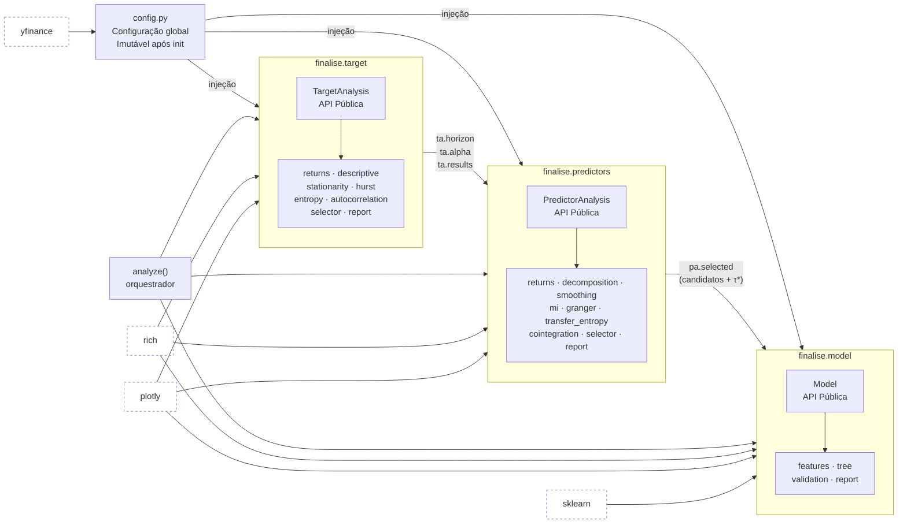
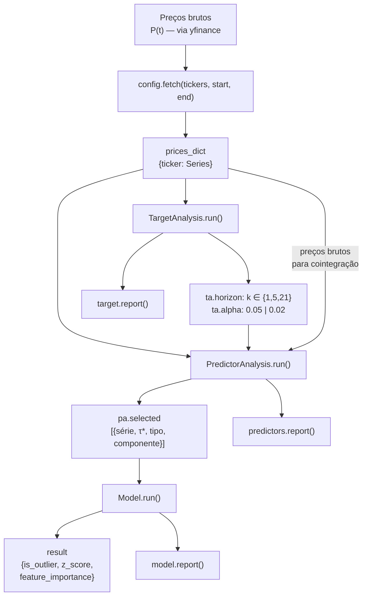
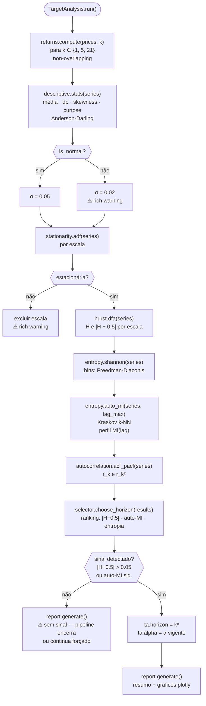
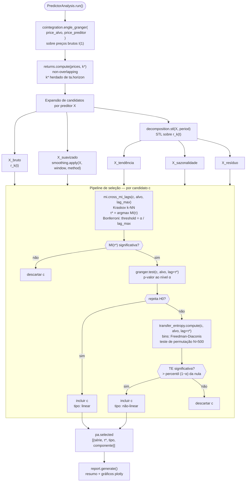
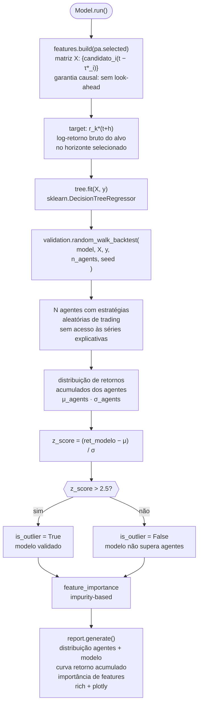
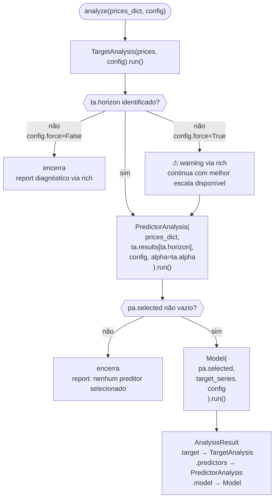
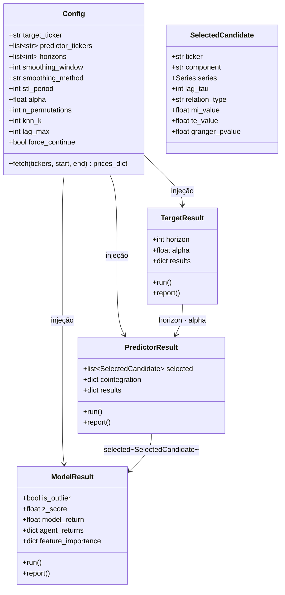

# Software Architecture Document — `finalise`

**Versão**: v1.0.0

---

## 1. Estrutura do Pacote

```mermaid
graph TD
    ROOT["finalise/"]

    ROOT --> ANALYZE["analyze.py\norquestrador opcional"]
    ROOT --> CONFIG["config.py"]
    ROOT --> TARGET["target/"]
    ROOT --> PREDICTORS["predictors/"]
    ROOT --> MODEL["model/"]

    TARGET --> T_INIT["__init__.py\nTargetAnalysis"]
    TARGET --> T_RET["returns.py"]
    TARGET --> T_DESC["descriptive.py"]
    TARGET --> T_STAT["stationarity.py"]
    TARGET --> T_HURST["hurst.py"]
    TARGET --> T_ENT["entropy.py"]
    TARGET --> T_ACF["autocorrelation.py"]
    TARGET --> T_SEL["selector.py"]
    TARGET --> T_REP["report.py"]

    PREDICTORS --> P_INIT["__init__.py\nPredictorAnalysis"]
    PREDICTORS --> P_RET["returns.py"]
    PREDICTORS --> P_DEC["decomposition.py"]
    PREDICTORS --> P_SMO["smoothing.py"]
    PREDICTORS --> P_MI["mi.py"]
    PREDICTORS --> P_GRA["granger.py"]
    PREDICTORS --> P_TE["transfer_entropy.py"]
    PREDICTORS --> P_COI["cointegration.py"]
    PREDICTORS --> P_SEL["selector.py"]
    PREDICTORS --> P_REP["report.py"]

    MODEL --> M_INIT["__init__.py\nModel"]
    MODEL --> M_FEAT["features.py"]
    MODEL --> M_TREE["tree.py"]
    MODEL --> M_VAL["validation.py"]
    MODEL --> M_REP["report.py"]
```

---

## 2. Arquitetura de Módulos e Dependências

---

## 3. Fluxo de Dados Global

---

## 4. Diagrama de Execução — `finalise.target`

---

## 5. Diagrama de Execução — `finalise.predictors`

---

## 6. Diagrama de Execução — `finalise.model`

---

## 7. Diagrama de Execução — Orquestrador `analyze()`

---

## 8. Contrato de Dados entre Módulos

